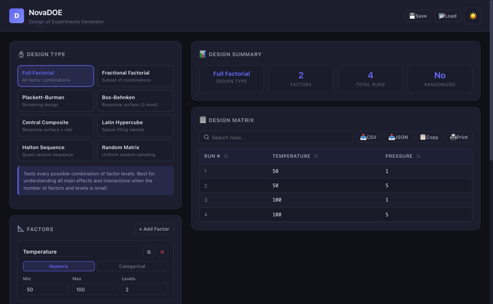

<div align="center">

# NovaDOE

[](https://developer.mozilla.org/en-US/docs/Web/HTML)
[](https://developer.mozilla.org/en-US/docs/Web/CSS)
[](https://developer.mozilla.org/en-US/docs/Web/JavaScript)
[](LICENSE)
[](https://alfredang.github.io/novadoe/)

**Modern Design of Experiments Generator — fully client-side, zero dependencies.**

[Live Demo](https://alfredang.github.io/novadoe/) · [Report Bug](https://github.com/alfredang/novadoe/issues) · [Request Feature](https://github.com/alfredang/novadoe/issues)

</div>

---

## Screenshot



## About

**NovaDOE** is a sleek, browser-based Design of Experiments (DOE) tool built entirely with vanilla HTML, CSS, and JavaScript. It provides 8 industry-standard DOE generation methods in a polished, modern analytics dashboard UI with dark and light themes.

No frameworks. No backend. No dependencies. Just open `index.html` and start designing experiments.

### Key Features

| Feature | Description |
|---------|-------------|
| **8 DOE Methods** | Full Factorial, Fractional Factorial, Plackett-Burman, Box-Behnken, Central Composite (CCC/CCI/CCF), Latin Hypercube, Halton Sequence, Random Matrix |
| **Dynamic Factor Builder** | Add, remove, duplicate factors with numeric or categorical types |
| **Interactive Results Table** | Sortable columns, search/filter, pagination, center point highlighting |
| **Export Options** | CSV, JSON, clipboard copy, and print |
| **Dark/Light Theme** | Toggle with localStorage persistence |
| **Preset Examples** | 4 built-in example designs to get started instantly |
| **Save/Load Setup** | Persist DOE configurations in browser storage |
| **Responsive Design** | Desktop 2-column layout, mobile-friendly stacked view |

## Tech Stack

| Category | Technology |
|----------|-----------|
| **Markup** | HTML5 |
| **Styling** | CSS3 (Custom Properties, Grid, Flexbox) |
| **Logic** | Vanilla JavaScript (ES6+) |
| **Deployment** | GitHub Pages |

## Architecture

```
┌─────────────────────────────────────────────────┐
│                   NovaDOE UI                     │
│  ┌──────────────────┐  ┌──────────────────────┐ │
│  │   Left Panel      │  │    Right Panel       │ │
│  │  ┌──────────────┐ │  │  ┌────────────────┐ │ │
│  │  │ DOE Selector │ │  │  │ Design Summary │ │ │
│  │  ├──────────────┤ │  │  ├────────────────┤ │ │
│  │  │ Factor Build │ │  │  │ Results Table  │ │ │
│  │  ├──────────────┤ │  │  │  (Sort/Filter) │ │ │
│  │  │ Config Panel │ │  │  ├────────────────┤ │ │
│  │  ├──────────────┤ │  │  │ Export Toolbar │ │ │
│  │  │   Presets    │ │  │  └────────────────┘ │ │
│  │  └──────────────┘ │  └──────────────────────┘ │
│  └──────────────────┘                            │
├─────────────────────────────────────────────────┤
│              DOE Generation Engine               │
│  Full Factorial │ Fractional │ Plackett-Burman   │
│  Box-Behnken │ CCD │ LHC │ Halton │ Random     │
├─────────────────────────────────────────────────┤
│          State Management & Utilities            │
│  Seeded PRNG │ Theme │ localStorage │ Export    │
└─────────────────────────────────────────────────┘
```

## Project Structure

```
novadoe/
├── index.html          # Complete single-file application
├── screenshot.png       # App screenshot
├── README.md            # This file
└── .github/
    └── workflows/
        └── deploy.yml   # GitHub Pages deployment
```

## Getting Started

### Prerequisites

- A modern web browser (Chrome, Firefox, Safari, Edge)
- That's it. No build tools, no package manager, no server.

### Run Locally

```bash
# Clone the repository
git clone https://github.com/alfredang/novadoe.git

# Open in browser
open novadoe/index.html
```

Or simply download `index.html` and double-click it.

### Run with Local Server (optional)

```bash
cd novadoe
python3 -m http.server 8080
# Visit http://localhost:8080
```

## DOE Methods

| Method | Use Case | Factors | Key Property |
|--------|----------|---------|--------------|
| **Full Factorial** | Small designs, all interactions | 2–6 | All combinations tested |
| **Fractional Factorial** | Screening many factors | 3+ | Subset via resolution |
| **Plackett-Burman** | Main effect screening | 2–23 | N runs for N-1 factors |
| **Box-Behnken** | Response surface, no extremes | 3–7 | 3-level, avoids corners |
| **Central Composite** | Full quadratic models | 2+ | Factorial + star + center |
| **Latin Hypercube** | Computer experiments | Any | Space-filling stratified |
| **Halton Sequence** | Quasi-random exploration | Any | Low-discrepancy sequence |
| **Random Matrix** | Monte Carlo, flexibility | Any | Uniform random sampling |

## Deployment

The app is deployed automatically to **GitHub Pages** on every push to `main` via GitHub Actions.

**Live URL:** [https://alfredang.github.io/novadoe/](https://alfredang.github.io/novadoe/)

## Contributing

Contributions are welcome!

1. Fork the repository
2. Create your feature branch (`git checkout -b feature/amazing-feature`)
3. Commit your changes (`git commit -m 'Add amazing feature'`)
4. Push to the branch (`git push origin feature/amazing-feature`)
5. Open a Pull Request

## Acknowledgements

- DOE methodology based on classical experimental design literature
- UI design inspired by the NovaStats design language
- Built with [Claude Code](https://claude.ai/code)

---

<div align="center">

**If you find NovaDOE useful, please consider giving it a star!**

</div>
